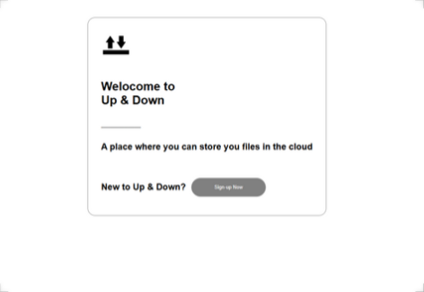
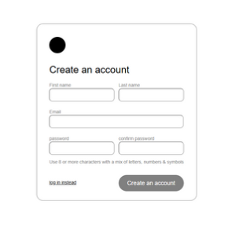
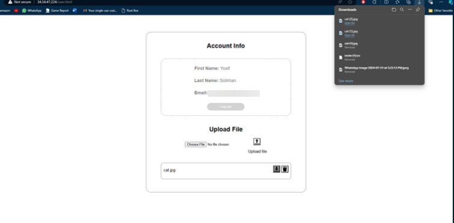

# Up & Down

This project is a cloud storage web application built using Node.js, Express, MySQL, and GCP cloud buckets. It provides similar functionalities to Google Drive, such as file uploading, downloading, and user authentication.

<center>



</center>

## Features

- **User Authentication**: Secure user registration and login using JWT.
- **File Listing**: List all files uploaded by the authenticated user.
- **File Upload**: Upload files to the storage.
- **File Download**: Download files from the storage.
- **File Deletion**: Delete files from the storage.
- **Security and Isolation**: Each user can only view and access their own files.

<center>





</center>

## API Documentation

### Authentication

- **POST /auth/register**: Register a new user.
- **POST /auth/login**: Login a user.

### Files

- **POST /files/upload**: Upload a file.
- **GET /files/download/:id**: Download a file by ID.
- **DELETE /files/delete/:id**: Delete a file by ID.
- **GET /users**: List the authenticated user's files.

## Project Structure

```
./
    .env
    .gitignore
    compose.yml
    config/
        config.js
        db.js
    package.json
    public/
        index.html
        login.html
        register.html
        styles-login.css
        styles-register.css
        styles-user.css
        styles-welcome.css
        user.html
    README.md
    service-account.json
    src/
        app.js
        controllers/
            authController.js
            fileController.js
            userController.js
        middlewares/
            authMiddleware.js
            errorMiddleware.js
            uploadMiddleware.js
        models/
            ...
        routes/
            ...
        services/
        utils/
```

## Getting Started

To get started with the project, follow these steps:

1. Clone the repository:
   ```
   git clone https://github.com/nightknighto/up-and-down.git
   ```

2. Install the dependencies:
   ```
   npm install
   ```

3. Create a `.env` file in the root directory and add the following environment variables:
   ```
   DB_HOST=your_database_host
   DB_PORT=your_database_port
   DB_USER=your_database_user
   DB_PASSWORD=your_database_password
   DB_NAME=your_database_name
   JWT_SECRET=your_jwt_secret
   GCS_PROJECT_ID=your_gcs_project_id
   GCS_BUCKET_NAME=your_gcs_bucket_name
   GCS_KEY_FILENAME=path_to_your_service_account_json
   ```

4. Start the application:
   ```
   npm start
   ```

5. For development mode with hot-reloading:
   ```
   npm run dev
   ```
